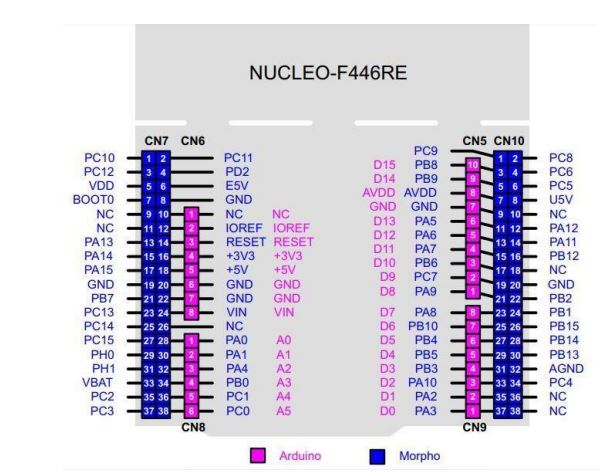

# ARM Microprocessor Experiments

Bare-metal C exercises on the STM32F446RE (NUCLEO-F446RE) using Keil uVision. No HAL — registers only. Everything is configured by directly writing to hardware registers, no libraries doing the heavy lifting.

## Experiments

| # | Topic | What it does |
|---|---|---|
| 2 | GPIO | Turn an LED on/off, read a button, drive a stepper motor forward and backward |
| 3 | Timers | Blink an LED with a timer, fade it with PWM, play a tone, react to a button press via interrupt |
| 4 | SysTick / Sonar | Use the CPU's built-in timer for precise delays; measure distance with an HC-SR04 ultrasonic sensor |
| 5 | ADC / DAC | Read an analog voltage (e.g. potentiometer), output an analog signal |

## Tasks

| # | What it does |
|---|---|
| task-1 | Reads an analog sensor — if the value is above the midpoint, spin the stepper one way; below, spin it the other way |
| task-2 | A button (PC13) toggles ADC sampling on and off via external interrupt; uses SysTick for timing |

## Board

NUCLEO-F446RE — STM32F446RETx, Cortex-M4 @ 180 MHz. Pin mapping follows the Arduino/Morpho header layout shown above.
